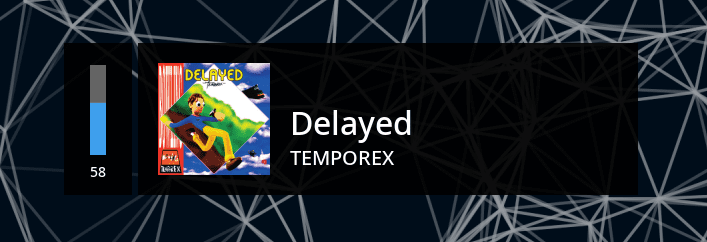

# touchegg-music-client


Widget for music and volume control, connected to [touchégg](https://github.com/JoseExposito/touchegg) 's daemon.

## How does it work?

The client connects to touchégg's daemon, and on every gesture update it asks every provider until one responds with a
metadata struct, and then displays the information through different windows.

### Metadata providers

The information displayed on the windows is sourced from different providers, there's currently only two providers:

#### Spotify Notifications Provider

It works by monitoring the notifications bus and parsing only the Spotify notifications. It supports showing the album
icon but it currently doesn't support the playback status.

#### Spotify Signals Provider

It works by listening to Spotify's DBus signals emitted when a property changes (either Metadata or PlaybackStatus).

### Windows

The program can show three different windows:

#### Volume window

This window is always displayed, it shows the current volume in the default PulseAudio sink.

#### Metadata window

If one of the providers returns a valid metadata struct, this window displays the song and artist's name, and if the
provider supports it an icon representing the playback status also is displayed.

#### Album icon window

If the metadata struct has a valid album icon, this window displays it.

## Dependencies

- Have [touchégg](https://github.com/JoseExposito/touchegg) installed and running
- libpulse (`libpulse` in Arch-based distros, `libpulse-dev` in Debian-based distros)

## Installation

You can find the package in the AUR
as [touchegg-music-client](https://aur.archlinux.org/packages/touchegg-music-client/)

```shell
$ paru -S touchegg-music-client
```

## Todo

- [x] Display album icon
- [x] SpotifySignalsProvider listening to Spotify's `PropertiesChanged` signal
- [ ] Configurable number of fingers/gesture direction
- [ ] Configurable windows
- [ ] Configurable providers priority
- [ ] Configurable PulseAudio sink
- [ ] ~~Migrate to pangomm for text rendering~~
- [x] Migrate to cairomm
- [ ] Migrate DBus connection to glibmm
- [ ] Add a configuration file
- [ ] Add new providers (chromium, vlc)
